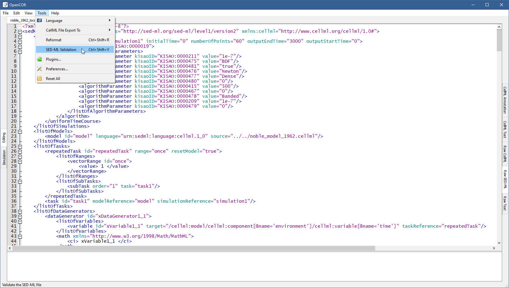
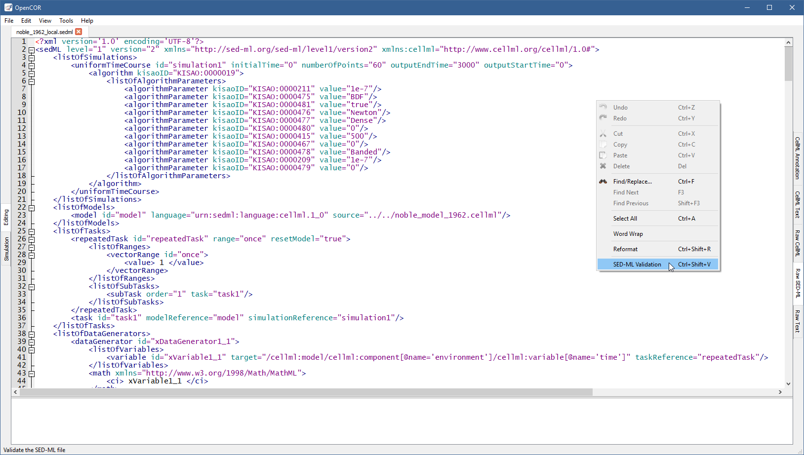

.. _plugins_editing_rawSedmlView:

=====================
 RawSEDMLView plugin
=====================

The RawSEDMLView plugin can be used to edit `SED-ML <http://www.sed-ml.org/>`__ files in their raw format using a text editor.
If you open a `SED-ML <http://www.sed-ml.org/>`__ file, then it will look something like:

.. image:: pics/RawSEDMLViewScreenshot01.png
   :align: center
   :scale: 25%

Apart from using syntax highlighting, the view has the same features as the :ref:`Raw Text <plugins_editing_rawTextView>` view.

The panel below the text editor is used to list any `SED-ML <http://www.sed-ml.org/>`__ issue that results from trying to validate a `SED-ML <http://www.sed-ml.org/>`__ file, which can be done either by pressing ``Ctrl``\ +\ ``T`` or through the ``Tools`` | ``SED-ML Validation`` menu or the context menu of the text editor:

If the `SED-ML <http://www.sed-ml.org/>`__ file is valid, then a message box confirming its validity gets displayed:

.. image:: pics/RawSEDMLViewScreenshot04.png
   :align: center
   :scale: 25%

Otherwise, the bottom panel lists all the issues with the `SED-ML <http://www.sed-ml.org/>`__ file:

.. image:: pics/RawSEDMLViewScreenshot05.png
   :align: center
   :scale: 25%

To double click on an issue will get the text editor to navigate to the corresponding line.

It may happen, while editing a model, that the contents of the text editor is not properly formatted anymore.
In this case, you can reformat it by pressing ``Ctrl``\ +\ ``R`` or through the ``Tools`` | ``Reformat`` menu or even the context menu of the text editor.
