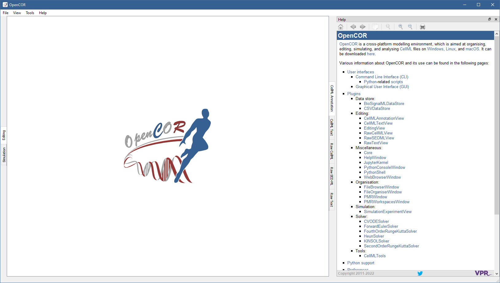

.. _plugins_miscellaneous_helpWindow:

===================
 HelpWindow plugin
===================

The HelpWindow plugin provides some user documentation, which contents is the same as the one found on the `OpenCOR website <http://www.opencor.ws/>`__:

Tool bar
--------

| |toolBarOxygenActionsGoHome|        Go to the home page
| |toolBarOxygenActionsGoPrevious|    Go back
| |toolBarOxygenActionsGoNext|        Go forward
| |toolBarOxygenActionsEditCopy|      Copy the selection to the clipboard
| |toolBarOxygenActionsZoomOriginal|  Reset the size of the help page contents
| |toolBarOxygenActionsZoomIn|        Zoom in the help page contents
| |toolBarOxygenActionsZoomOut|       Zoom out the help page contents
| |toolBarOxygenActionsDocumentPrint| Print the help page contents

.. |toolBarOxygenActionsGoHome| image:: ../../pics/oxygen/actions/go-home.png
   :class: toolBar
   :scale: 50%

.. |toolBarOxygenActionsGoPrevious| image:: ../../pics/oxygen/actions/go-previous.png
   :class: toolBar
   :scale: 50%

.. |toolBarOxygenActionsGoNext| image:: ../../pics/oxygen/actions/go-next.png
   :class: toolBar
   :scale: 50%

.. |toolBarOxygenActionsEditCopy| image:: ../../pics/oxygen/actions/edit-copy.png
   :class: toolBar
   :scale: 50%

.. |toolBarOxygenActionsZoomOriginal| image:: ../../pics/oxygen/actions/zoom-original.png
   :class: toolBar
   :scale: 50%

.. |toolBarOxygenActionsZoomIn| image:: ../../pics/oxygen/actions/zoom-in.png
   :class: toolBar
   :scale: 50%

.. |toolBarOxygenActionsZoomOut| image:: ../../pics/oxygen/actions/zoom-out.png
   :class: toolBar
   :scale: 50%

.. |toolBarOxygenActionsDocumentPrint| image:: ../../pics/oxygen/actions/document-print.png
   :class: toolBar
   :scale: 50%
