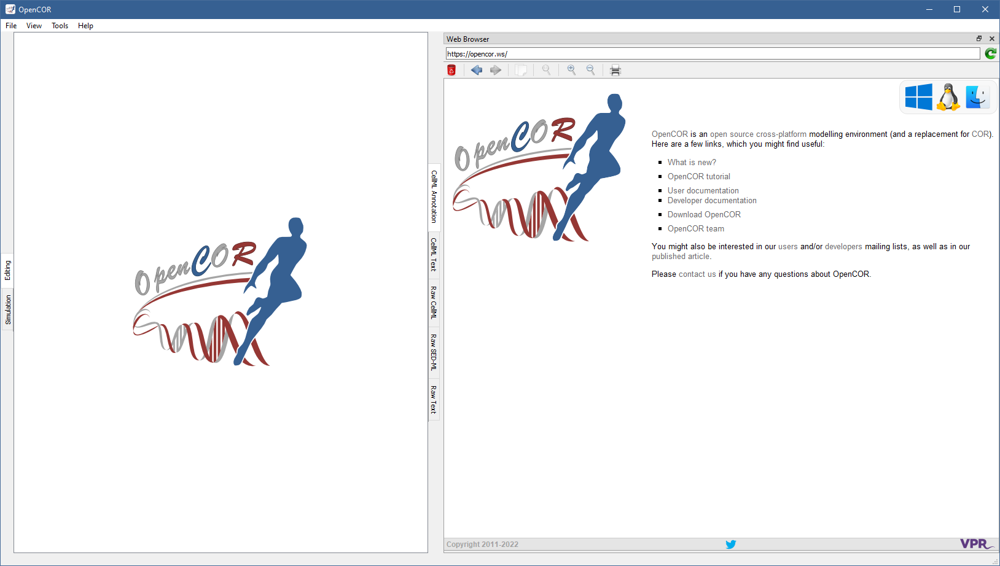

.. _plugins_miscellaneous_webBrowserWindow:

=========================
 WebBrowserWindow plugin
=========================

The WebBrowserWindow plugin is a basic `WebKit <https://webkit.org/>`__-based browser.
It renders Web sites in the same way as any other Web browser, as illustrated with the `OpenCOR website <http://www.opencor.ws/>`__:

Tool bar
--------

| |oxygenActionsTrashEmpty|    Clear the page
| |oxygenActionsGoPrevious|    Go back
| |oxygenActionsGoNext|        Go forward
| |oxygenActionsEditCopy|      Copy the selection to the clipboard
| |oxygenActionsZoomOriginal|  Reset the size of the help page contents
| |oxygenActionsZoomIn|        Zoom in the help page contents
| |oxygenActionsZoomOut|       Zoom out the help page contents
| |oxygenActionsDocumentPrint| Print the help page contents

.. |oxygenActionsTrashEmpty| image:: ../../pics/oxygen/actions/trash-empty.png
   :class: toolbar
   :scale: 50%

.. |oxygenActionsGoPrevious| image:: ../../pics/oxygen/actions/go-previous.png
   :class: toolbar
   :scale: 50%

.. |oxygenActionsGoNext| image:: ../../pics/oxygen/actions/go-next.png
   :class: toolbar
   :scale: 50%

.. |oxygenActionsEditCopy| image:: ../../pics/oxygen/actions/edit-copy.png
   :class: toolbar
   :scale: 50%

.. |oxygenActionsZoomOriginal| image:: ../../pics/oxygen/actions/zoom-original.png
   :class: toolbar
   :scale: 50%

.. |oxygenActionsZoomIn| image:: ../../pics/oxygen/actions/zoom-in.png
   :class: toolbar
   :scale: 50%

.. |oxygenActionsZoomOut| image:: ../../pics/oxygen/actions/zoom-out.png
   :class: toolbar
   :scale: 50%

.. |oxygenActionsDocumentPrint| image:: ../../pics/oxygen/actions/document-print.png
   :class: toolbar
   :scale: 50%
