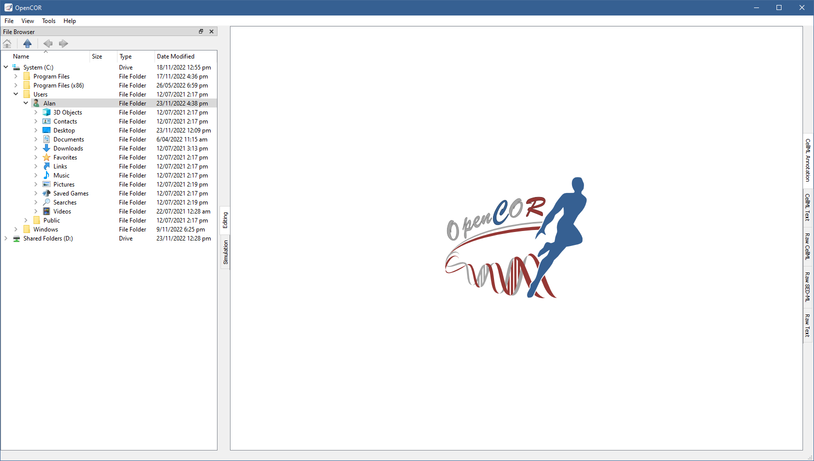
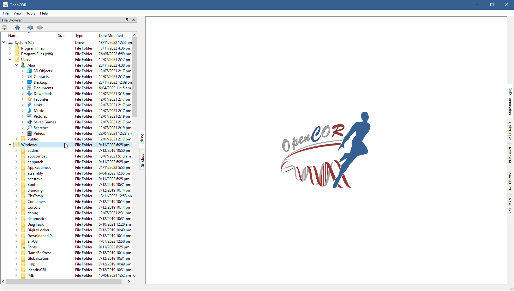

.. _plugins_organisation_fileBrowserWindow:

==========================
 FileBrowserWindow plugin
==========================

The FileBrowserWindow plugin offers a convenient way to access your (physical) files, remembering the folder or file that was selected when you last ran OpenCOR.
By default, your home directory is selected:

As you would expect, to double click on a folder expands its contents, as can be seen by double clicking on the ``Windows`` directory:

Similarly, to double click on a file results in that file being opened in OpenCOR.
Its rendering depends either on its type, if it is recognised, or on the view being currently selected.

Files can also be dragged from the :ref:`File Browser window <plugins_organisation_fileBrowserWindow>` onto the :ref:`File Organiser window <plugins_organisation_fileOrganiserWindow>`.

Tool bar
--------

| |toolbarOxygenActionsGoHome|     Go to the home folder
| |toolbarOxygenActionsGoUp|       Go to the parent folder
| |toolbarOxygenActionsGoPrevious| Go to the previous folder or file
| |toolbarOxygenActionsGoNext|     Go to the next folder or file

.. |toolbarOxygenActionsGoHome| image:: ../../pics/oxygen/actions/go-home.png
   :class: toolbar
   :scale: 50%

.. |toolbarOxygenActionsGoUp| image:: ../../pics/oxygen/actions/go-up.png
   :class: toolbar
   :scale: 50%

.. |toolbarOxygenActionsGoPrevious| image:: ../../pics/oxygen/actions/go-previous.png
   :class: toolbar
   :scale: 50%

.. |toolbarOxygenActionsGoNext| image:: ../../pics/oxygen/actions/go-next.png
   :class: toolbar
   :scale: 50%
