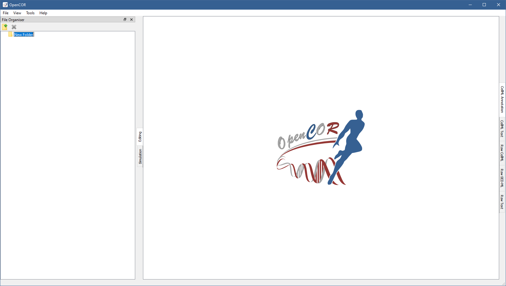
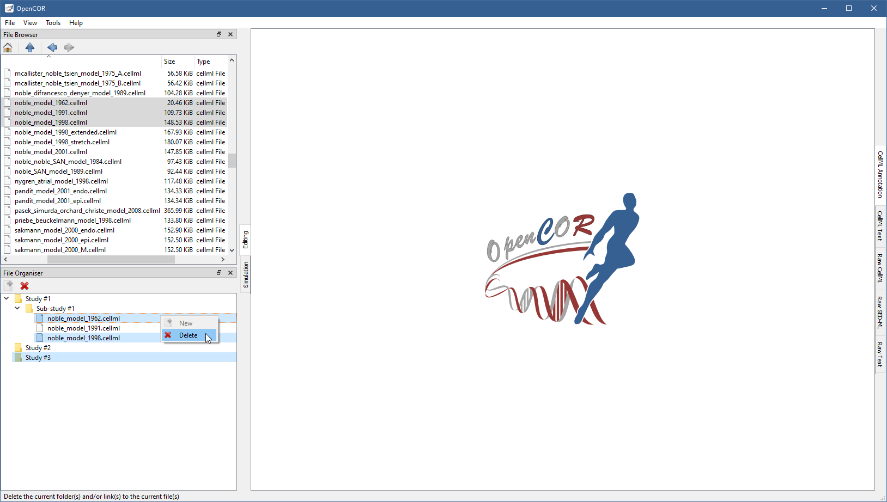

.. _plugins_organisation_fileOrganiserWindow:

============================
 FileOrganiserWindow plugin
============================

The FileOrganiserWindow plugin allows you to organise your files in a virtual manner, i.e. independently of where they are physically located.
Your virtual environment is remembered from one session to another and is originally empty:

.. image:: pics/FileOrganiserWindowScreenshot01.png
   :align: center
   :scale: 25%

To create a (virtual) folder, you need to click on the |newFolder| button in the toolbar (or use the context menu):

.. |newFolder| image:: ../../pics/newFolder.png

The folder can be renamed (by pressing ``F2`` on `Windows <https://en.wikipedia.org/wiki/Microsoft_Windows>`__/`Linux <https://en.wikipedia.org/wiki/Linux>`__ or ``Enter`` on `macOS <https://en.wikipedia.org/wiki/MacOS>`__) and other (sub-)folders created, if needed:

The (sub-)folders can be moved around by dragging and dropping them within your virtual environment.
An existing (sub-)folder can be deleted by clicking on the |oxygenActionsEditDelete| button in the toolbar (or by using the context menu):

.. |oxygenActionsEditDelete| image:: ../../pics/oxygen/actions/edit-delete.png
   :class: nonclickable
   :scale: 50%

Files can be dragged and dropped from the :ref:`File Browser window <plugins_organisation_fileBrowserWindow>` (or the system's file manager) onto your virtual environment:

.. image:: pics/FileOrganiserWindowScreenshot05.png
   :align: center
   :scale: 25%

As for folders, (virtual) files can be moved/deleted (together with folders or not):

Tool bar
--------

| |toolbarNewFolder|               Create a new folder
| |toolbarOxygenActionsEditDelete| Delete the current folder(s) and/or link(s) to the current file(s)

.. |toolbarNewFolder| image:: ../../pics/newFolder.png
   :class: enlarge toolbar

.. |toolbarOxygenActionsEditDelete| image:: ../../pics/oxygen/actions/edit-delete.png
   :class: toolbar
   :scale: 50%
