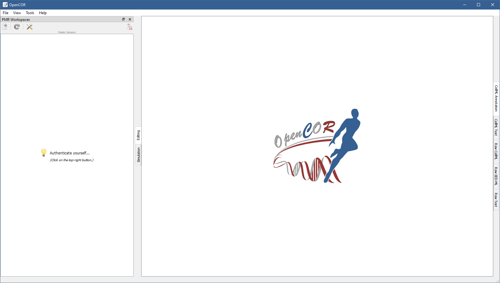
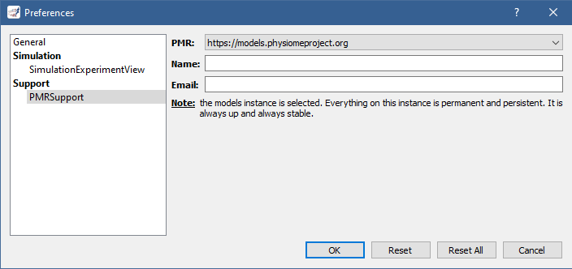
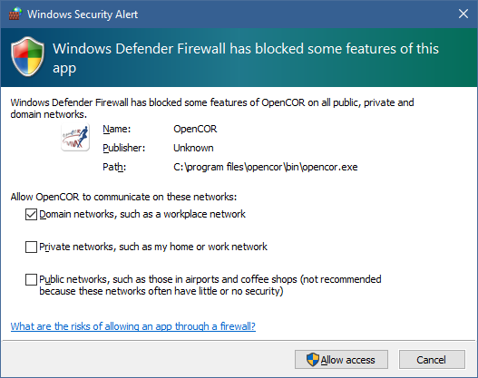
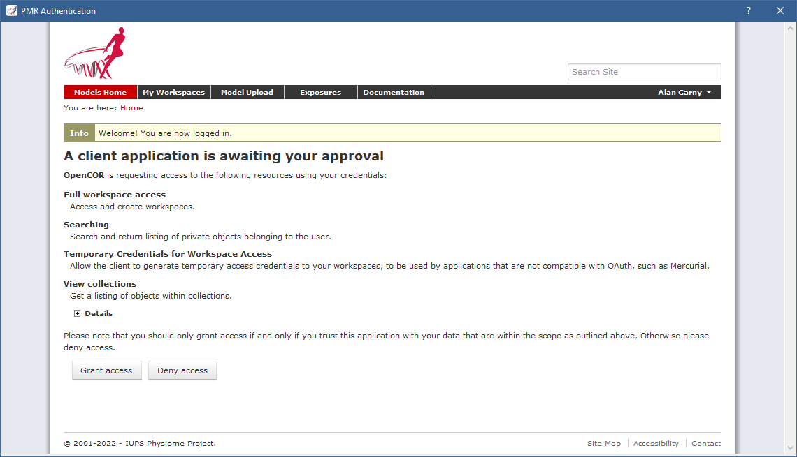
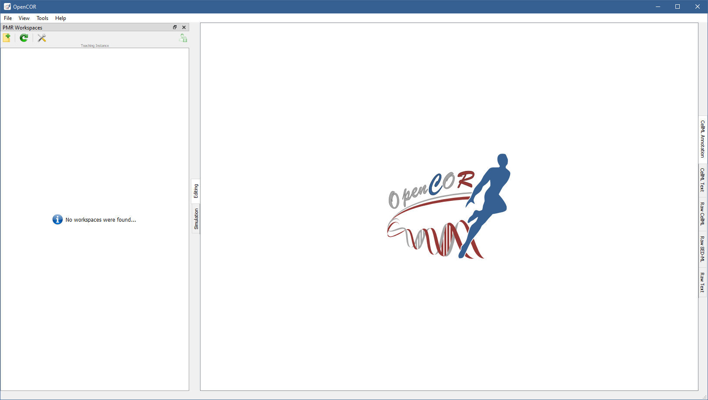

.. _plugins_organisation_pmrWorkspacesWindow:

============================
 PMRWorkspacesWindow plugin
============================

The PMRWorkspacesWindow plugin gives you access to your `PMR <https://models.physiomeproject.org/>`__ workspaces.
By default, it looks as follows:

Preferences
-----------

There are three instances of `PMR <https://models.physiomeproject.org/>`__:

- `Primary instance <https://models.physiomeproject.org>`__: everything on this instance is permanent and persistent.
  It is always up and always stable.
- `Staging instance <https://staging.physiomeproject.org>`__: it is used for public testing/preview of PMR developments.
  Data on this instance is wiped periodically whenever a new public testing/preview of the PMR software suite is released for the required testing exercise.
- `Teaching instance <https://teaching.physiomeproject.org>`__: the functionality of this instance should match the primary instance, but without the data persistency guarantees.
  While data on this instance is also not permanent, any wipes to data stored will be announced on the `cellml-discussion mailing list <https://lists.cellml.org/sympa/info/cellml-discussion>`__.

Both the `primary instance <https://models.physiomeproject.org>`__ and the `teaching instance <https://teaching.physiomeproject.org>`__ require you to create an account before you can start interacting with them.
On the `staging instance <https://staging.physiomeproject.org>`__, your `primary instance <https://models.physiomeproject.org>`__ account may work, but if not then you need to create an account (on the `staging instance <https://staging.physiomeproject.org>`__).

You can specify which instance you want to interact with by clicking on the |oxygenCategoriesPreferencesSystem| button in the toolbar, or by selecting the ``Tools`` | ``Preferences...`` menu and then the ``PMRSupport`` section:

.. |oxygenCategoriesPreferencesSystem| image:: ../../pics/oxygen/categories/preferences-system.png
   :class: nonclickable
   :scale: 33%

This is also where you must specify your name and email address, if you want to be able to synchronise your workspaces with `PMR <https://models.physiomeproject.org/>`__.

Log on to PMR
-------------

To log on to `PMR <https://models.physiomeproject.org/>`__, you need to click on the |logOn| button in the toolbar.
This brings up a window inviting you to log in to `PMR <https://models.physiomeproject.org/>`__:

.. |logOn| image:: pics/logOn.png
   :class: nonclickable
   :scale: 33%

Logged in, you can grant OpenCOR access to `PMR <https://models.physiomeproject.org/>`__ by clicking on the ``Grant access`` button:

This closes the window and replaces the |logOn| button with the |logOff| button, and displays a message indicating that, as expected, no workspaces were found:

.. |logOff| image:: pics/logOff.png
   :class: nonclickable
   :scale: 33%

Icons
-----

Different icons are used to distinguish between the different states of public and owned workspaces:

.. table::
   :class: icons

   +-------------------------+---+------------------------------+---------------------------------------------------+
   | |iconWorkspace|         | / | |iconOwnedWorkspace|         | Public/owned workspace                            |
   +-------------------------+---+------------------------------+---------------------------------------------------+
   | |iconStagedWorkspace|   | / | |iconStagedOwnedWorkspace|   | Public/owned workspace with *staged* changes.     |
   +-------------------------+---+------------------------------+---------------------------------------------------+
   | |iconUnstagedWorkspace| | / | |iconUnstagedOwnedWorkspace| | Public/owned workspace with *unstaged* changes    |
   +-------------------------+---+------------------------------+---------------------------------------------------+
   | |iconConflictWorkspace| | / | |iconConflictOwnedWorkspace| | Public/owned workspace with *conflicting* changes |
   +-------------------------+---+------------------------------+---------------------------------------------------+

.. |iconWorkspace| image:: pics/workspace.png
   :class: icon
   :scale: 50%

.. |iconOwnedWorkspace| image:: pics/ownedWorkspace.png
   :class: icon
   :scale: 50%

Similarly, different icons are used to distinguish the state of staged/unstaged files:

.. table::
   :class: icons

   +--------------+---+--------------+-----------------------------------------------+
   | |iconIaFile| | / | |iconWaFile| | Staged/unstaged file that has been *added*    |
   +--------------+---+--------------+-----------------------------------------------+
   | |iconIdFile| | / | |iconWdFile| | Staged/unstaged file that has been *deleted*  |
   +--------------+---+--------------+-----------------------------------------------+
   | |iconImFile| | / | |iconWmFile| | Staged/unstaged file that has been *modified* |
   +--------------+---+--------------+-----------------------------------------------+
   | |iconIrFile| | / | |iconWrFile| | Staged/unstaged file that has been *renamed*  |
   +--------------+---+--------------+-----------------------------------------------+
   | |iconItFile| | / | |iconWtFile| | Staged/unstaged file which type has *changed* |
   +--------------+---+--------------+-----------------------------------------------+
   |              |   | |iconWuFile| | File that is *unreadable*                     |
   +--------------+---+--------------+-----------------------------------------------+
   |              |   | |iconGcFile| | File that has *conflicts*                     |
   +--------------+---+--------------+-----------------------------------------------+
   |              |   | |iconGiFile| | File that is *ignored*                        |
   +--------------+---+--------------+-----------------------------------------------+

.. |iconIaFile| image:: pics/iaFile.png
   :class: icon
   :scale: 50%

.. |iconImFile| image:: pics/imFile.png
   :class: icon
   :scale: 50%

.. |iconWuFile| image:: pics/wuFile.png
   :class: icon
   :scale: 50%

.. |iconGcFile| image:: pics/gcFile.png
   :class: icon
   :scale: 50%

.. |iconGiFile| image:: pics/giFile.png
   :class: icon
   :scale: 50%

Tool bar
--------

| |toolbarNewFolder|                         Create a new workspace
| |toolbarOxygenActionsViewRefresh|          Reload the list of workspaces
| |toolbarOxygenCategoriesPreferencesSystem| Preferences for PMR support
| |toolbarLogOn|                             Log on to PMR
| |toolbarLogOff|                            Log off from PMR

.. |toolbarOxygenActionsViewRefresh| image:: ../../pics/oxygen/actions/view-refresh.png
   :class: toolbar
   :scale: 50%

.. |toolbarOxygenCategoriesPreferencesSystem| image:: ../../pics/oxygen/categories/preferences-system.png
   :class: toolbar
   :scale: 50%

.. |toolbarLogOn| image:: pics/logOn.png
   :class: toolbar
   :scale: 50%

.. |toolbarLogOff| image:: pics/logOff.png
   :class: toolbar
   :scale: 50%
