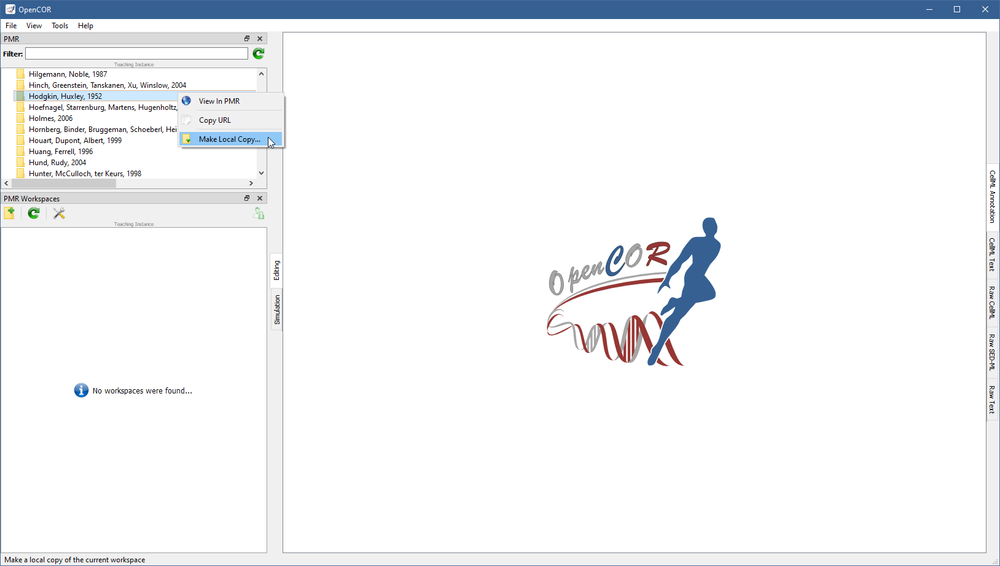

.. _plugins_organisation_pmrWorkspacesWindow:

============================
 PMRWorkspacesWindow plugin
============================

The PMRWorkspacesWindow plugin gives you access to your `PMR <https://models.physiomeproject.org/>`__ workspaces.
By default, it looks as follows:

.. image:: pics/PMRWorkspacesWindowScreenshot01.png
   :align: center
   :scale: 25%

Preferences
-----------

There are three `PMR <https://models.physiomeproject.org/>`__ sites:

- `Primary site <https://models.physiomeproject.org>`__: everything on this site is permanent and persistent.
  It is always up and always stable.
- `Staging site <https://staging.physiomeproject.org>`__: it is used for public testing/preview of PMR developments.
  Data on this site is wiped periodically whenever a new public testing/preview of the PMR software suite is released for the required testing exercise.
- `Teaching site <https://teaching.physiomeproject.org>`__: the functionality of this site should match the primary site, but without the data persistency guarantees.
  While data on this site is also not permanent, any wipes to data stored will be announced on the `cellml-discussion mailing list <https://lists.cellml.org/sympa/info/cellml-discussion>`__.

Both the `primary site <https://models.physiomeproject.org>`__ and the `teaching site <https://teaching.physiomeproject.org>`__ require you to create an account before you can start interacting with them.
On the `staging site <https://staging.physiomeproject.org>`__, your `primary site <https://models.physiomeproject.org>`__ account may work, but if not then you need to create an account (on the `staging site <https://staging.physiomeproject.org>`__).

You can specify which site you want to interact with by clicking on the |oxygenCategoriesPreferencesSystem| button in the toolbar, or by selecting the ``Tools`` | ``Preferences...`` menu and then the ``PMRSupport`` section:

.. |oxygenCategoriesPreferencesSystem| image:: ../../pics/oxygen/categories/preferences-system.png
   :class: nonclickable
   :scale: 33%

.. image:: pics/PMRWorkspacesWindowScreenshot02.png
   :align: center
   :scale: 25%

This is also where you must specify your name and email address, if you want to be able to synchronise your workspaces with `PMR <https://models.physiomeproject.org/>`__.

Log on to PMR
-------------

To log on to `PMR <https://models.physiomeproject.org/>`__, you need to click on the |logOn| button in the toolbar.
On `Windows <https://en.wikipedia.org/wiki/Microsoft_Windows>`__, you may see a security alert that looks something like:

.. |logOn| image:: pics/logOn.png
   :class: nonclickable
   :scale: 33%

.. image:: pics/PMRWorkspacesWindowScreenshot03.png
   :align: center
   :scale: 25%

It is nothing to worry about when it comes to OpenCOR, so simply click on the ``Allow access`` button.
In all cases, a window pops up, inviting you to log in to `PMR <https://models.physiomeproject.org/>`__:

Logged in, you can grant OpenCOR access to `PMR <https://models.physiomeproject.org/>`__ by clicking on the ``Grant access`` button:

.. image:: pics/PMRWorkspacesWindowScreenshot05.png
   :align: center
   :scale: 25%

Upon granting OpenCOR access to `PMR <https://models.physiomeproject.org/>`__, the window closes and the |logOn| button is replaced with the |logOff| button.

.. |logOff| image:: pics/logOff.png
   :class: nonclickable
   :scale: 33%

Tool bar
--------

| |toolbarNewFolder|                         Create a new workspace
| |toolbarOxygenActionsViewRefresh|          Reload the list of workspaces
| |toolbarOxygenCategoriesPreferencesSystem| Preferences for PMR support
| |toolbarLogOn|                             Log on to PMR
| |toolbarLogOff|                            Log off from PMR

.. |toolbarNewFolder| image:: ../../pics/newFolder.png
   :class: toolbar
   :scale: 50%

.. |toolbarOxygenActionsViewRefresh| image:: ../../pics/oxygen/actions/view-refresh.png
   :class: toolbar
   :scale: 50%

.. |toolbarOxygenCategoriesPreferencesSystem| image:: ../../pics/oxygen/categories/preferences-system.png
   :class: toolbar
   :scale: 50%

.. |toolbarLogOn| image:: pics/logOn.png
   :class: toolbar
   :scale: 50%

.. |toolbarLogOff| image:: pics/logOff.png
   :class: toolbar
   :scale: 50%
