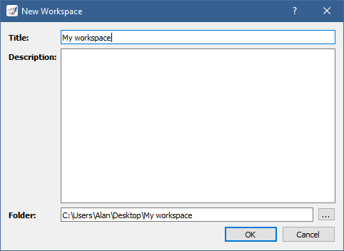
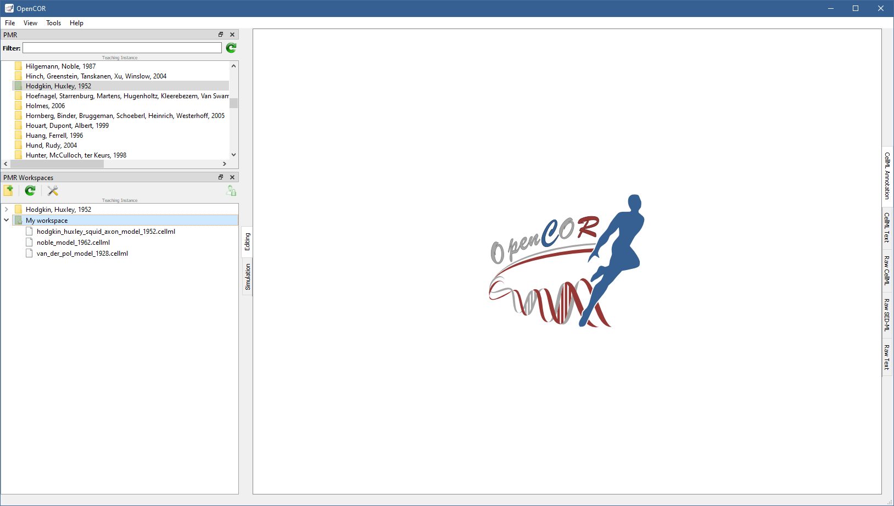

.. _plugins_organisation_pmrWorkspacesWindow:

============================
 PMRWorkspacesWindow plugin
============================

The PMRWorkspacesWindow plugin gives you access to your `PMR <https://models.physiomeproject.org/>`__ workspaces.
By default, it looks as follows:

.. image:: pics/PMRWorkspacesWindowScreenshot01.png
   :align: center
   :scale: 25%

.. _plugins_organisation_pmrWorkspacesWindow_preferences:

Preferences
-----------

There are three instances of `PMR <https://models.physiomeproject.org/>`__:

- `Primary instance <https://models.physiomeproject.org>`__: everything on this instance is permanent and persistent.
  It is always up and always stable.
- `Staging instance <https://staging.physiomeproject.org>`__: it is used for public testing/preview of PMR developments.
  Data on this instance is wiped periodically whenever a new public testing/preview of the PMR software suite is released for the required testing exercise.
- `Teaching instance <https://teaching.physiomeproject.org>`__: the functionality of this instance should match the primary instance, but without the data persistency guarantees.
  While data on this instance is also not permanent, any wipes to data stored will be announced on the `cellml-discussion mailing list <https://lists.cellml.org/sympa/info/cellml-discussion>`__.

Both the `primary instance <https://models.physiomeproject.org>`__ and the `teaching instance <https://teaching.physiomeproject.org>`__ require you to create an account before you can start interacting with them.
On the `staging instance <https://staging.physiomeproject.org>`__, your `primary instance <https://models.physiomeproject.org>`__ account may work, but if not then you need to create an account (on the `staging instance <https://staging.physiomeproject.org>`__).

You can specify which instance you want to interact with by clicking on the |oxygenCategoriesPreferencesSystem| button in the toolbar, or by selecting the ``Tools`` | ``Preferences...`` menu and then the ``PMRSupport`` section:

.. |oxygenCategoriesPreferencesSystem| image:: ../../pics/oxygen/categories/preferences-system.png
   :class: nonclickable
   :scale: 33%

.. image:: pics/PMRWorkspacesWindowScreenshot02.png
   :align: center
   :scale: 25%

This is also where you must specify your name and email address, if you want to be able to synchronise your workspaces with `PMR <https://models.physiomeproject.org/>`__.

Log on to PMR
-------------

To log on to `PMR <https://models.physiomeproject.org/>`__, you need to click on the |logOn| button in the toolbar.
This brings up a window inviting you to log in to `PMR <https://models.physiomeproject.org/>`__:

.. |logOn| image:: pics/logOn.png
   :class: nonclickable
   :scale: 33%

.. image:: pics/PMRWorkspacesWindowScreenshot03.png
   :align: center
   :scale: 25%

Logged in, you can grant OpenCOR access to `PMR <https://models.physiomeproject.org/>`__ by clicking on the ``Grant access`` button:

.. image:: pics/PMRWorkspacesWindowScreenshot04.png
   :align: center
   :scale: 25%

This closes the window and replaces the |logOn| button with the |logOff| button, and displays a message indicating that, as expected, no workspaces were found:

.. |logOff| image:: pics/logOff.png
   :class: nonclickable
   :scale: 33%

.. image:: pics/PMRWorkspacesWindowScreenshot05.png
   :align: center
   :scale: 25%

Make a local copy of a public workspace
---------------------------------------

The :ref:`PMR Window <plugins_organisation_pmrWindow>` lists published exposures, which reference a specific state of a public workspace.
Say that you want to experiment with the `Hodgkin–Huxley model <https://www.ncbi.nlm.nih.gov/pmc/articles/PMC1392413/pdf/jphysiol01442-0106.pdf>`__.
You can do so by switching to the teaching instance (see :ref:`above <plugins_organisation_pmrWorkspacesWindow_preferences>`), looking for the `Hodgkin–Huxley model <https://www.ncbi.nlm.nih.gov/pmc/articles/PMC1392413/pdf/jphysiol01442-0106.pdf>`__ in the list, right clicking on it and selecting ``Make Local Copy...``:

.. image:: pics/PMRWorkspacesWindowScreenshot06.png
   :align: center
   :scale: 25%

You need to provide the path to an empty folder.
The local copy completed, you can double click on it to reveal its contents:

.. image:: pics/PMRWorkspacesWindowScreenshot07.png
   :align: center
   :scale: 25%

Create a new workspace
----------------------

You can create a workspace by clicking on the |newFolder| button in the toolbar.
You need to provide both a name and the path to a folder (it does not have to be empty).
You may also provide a description:

.. |newFolder| image:: ../../pics/newFolder.png
   :class: nonclickable
   :scale: 33%

Any file already present in the folder you provided will automatically be considered new.
For example, if you provide a folder containing the `models <https://github.com/opencor/opencor/tree/master/models>`__ shipped with OpenCOR, you will get something like the following upon creation of the workspace:

The model files are preceded by the |waFile| icon, which means that they are indeed new, while the workspace folder is preceded by the |unstagedOwnedWorkspace| icon, which means that it is owned by you and that it contains changes that have yet to be synchronised (see :ref:`below <plugins_organisation_pmrWorkspacesWindow_icons>` for the full set of possible icons).

.. |waFile| image:: pics/waFile.png
   :class: nonclickable
   :scale: 33%

.. |unstagedOwnedWorkspace| image:: pics/unstagedOwnedWorkspace.png
   :class: nonclickable
   :scale: 33%

Synchronise with PMR
--------------------

Your workspace created, you may want to syncrhonise it with `PMR <https://models.physiomeproject.org/>`__.
This is done by right clicking on any of the files/folders in your workspace and by selecting the ``Synchronise Workspace With PMR...`` menu.
This brings up a window where you can see *which* files have changed and *what* exactly has changed.
For `CellML <https://www.cellml.org/>`__ files, changes can be seen using either the :ref:`CellML Text format <plugins_editing_cellmlTextView_cellmlTextFormat>` or the raw CellML format (i.e. `XML <https://www.w3.org/XML/>`__-based).
Simply toggle the |logo| button as you see fit:

.. |logo| image:: pics/logo.png
   :class: nonclickable
   :scale: 63%

.. image:: pics/PMRWorkspacesWindowScreenshot10.png
   :align: center
   :scale: 25%

Provide a description for your changes and click on the ``OK`` button to synchronise your workspace with `PMR <https://models.physiomeproject.org/>`__.
As you can see, the model files are now preceded by the |file| icon and the workspace folder by the |ownedWorkspace| icon:

.. |file| image:: pics/file.png
   :class: nonclickable
   :scale: 33%

.. |ownedWorkspace| image:: pics/ownedWorkspace.png
   :class: nonclickable
   :scale: 33%

You can see your workspace in `PMR <https://models.physiomeproject.org/>`__ by right clicking on any of the files/folders in your workspace and by selecting the ``Synchronise Workspace With PMR...`` menu:

.. image:: pics/PMRWorkspacesWindowScreenshot12.png
   :align: center
   :scale: 25%

If you modify the model files and decide to resynchronise your workspace with `PMR <https://models.physiomeproject.org/>`__, you will see something like the following:

.. image:: pics/PMRWorkspacesWindowScreenshot13.png
   :align: center
   :scale: 25%

All the model files can be selected to see all their changes at once, be they additions (in green) or deletions (in red).

Your workspace resynchronised, you can see the history of your changes in `PMR <https://models.physiomeproject.org/>`__:

.. image:: pics/PMRWorkspacesWindowScreenshot14.png
   :align: center
   :scale: 25%

.. _plugins_organisation_pmrWorkspacesWindow_icons:

Icons
-----

Different icons are used to distinguish between the different states of public and owned workspaces:

.. table::
   :class: icons

   +-------------------------+---+------------------------------+---------------------------------------------------+
   | |iconWorkspace|         | / | |iconOwnedWorkspace|         | Public/owned workspace                            |
   +-------------------------+---+------------------------------+---------------------------------------------------+
   | |iconStagedWorkspace|   | / | |iconStagedOwnedWorkspace|   | Public/owned workspace with *staged* changes.     |
   +-------------------------+---+------------------------------+---------------------------------------------------+
   | |iconUnstagedWorkspace| | / | |iconUnstagedOwnedWorkspace| | Public/owned workspace with *unstaged* changes    |
   +-------------------------+---+------------------------------+---------------------------------------------------+
   | |iconConflictWorkspace| | / | |iconConflictOwnedWorkspace| | Public/owned workspace with *conflicting* changes |
   +-------------------------+---+------------------------------+---------------------------------------------------+

.. |iconWorkspace| image:: pics/workspace.png
   :class: icon
   :scale: 50%

.. |iconStagedWorkspace| image:: pics/stagedWorkspace.png
   :class: icon
   :scale: 50%

.. |iconUnstagedWorkspace| image:: pics/unstagedWorkspace.png
   :class: icon
   :scale: 50%

.. |iconConflictWorkspace| image:: pics/conflictWorkspace.png
   :class: icon
   :scale: 50%

.. |iconOwnedWorkspace| image:: pics/ownedWorkspace.png
   :class: icon
   :scale: 50%

.. |iconStagedOwnedWorkspace| image:: pics/stagedOwnedWorkspace.png
   :class: icon
   :scale: 50%

.. |iconUnstagedOwnedWorkspace| image:: pics/unstagedOwnedWorkspace.png
   :class: icon
   :scale: 50%

.. |iconConflictOwnedWorkspace| image:: pics/conflictOwnedWorkspace.png
   :class: icon
   :scale: 50%

Similarly, different icons are used to distinguish the state of staged/unstaged files:

.. table::
   :class: icons

   +--------------+---+--------------+-----------------------------------------------+
   |              |   | |iconFile|   | File that is *clean*                          |
   +--------------+---+--------------+-----------------------------------------------+
   | |iconIaFile| | / | |iconWaFile| | Staged/unstaged file that has been *added*    |
   +--------------+---+--------------+-----------------------------------------------+
   | |iconIdFile| | / | |iconWdFile| | Staged/unstaged file that has been *deleted*  |
   +--------------+---+--------------+-----------------------------------------------+
   | |iconImFile| | / | |iconWmFile| | Staged/unstaged file that has been *modified* |
   +--------------+---+--------------+-----------------------------------------------+
   | |iconIrFile| | / | |iconWrFile| | Staged/unstaged file that has been *renamed*  |
   +--------------+---+--------------+-----------------------------------------------+
   | |iconItFile| | / | |iconWtFile| | Staged/unstaged file which type has *changed* |
   +--------------+---+--------------+-----------------------------------------------+
   |              |   | |iconWuFile| | File that is *unreadable*                     |
   +--------------+---+--------------+-----------------------------------------------+
   |              |   | |iconGcFile| | File that has *conflicts*                     |
   +--------------+---+--------------+-----------------------------------------------+
   |              |   | |iconGiFile| | File that is *ignored*                        |
   +--------------+---+--------------+-----------------------------------------------+

.. |iconFile| image:: pics/file.png
   :class: icon
   :scale: 50%

.. |iconIaFile| image:: pics/iaFile.png
   :class: icon
   :scale: 50%

.. |iconIdFile| image:: pics/idFile.png
   :class: icon
   :scale: 50%

.. |iconImFile| image:: pics/imFile.png
   :class: icon
   :scale: 50%

.. |iconIrFile| image:: pics/irFile.png
   :class: icon
   :scale: 50%

.. |iconItFile| image:: pics/itFile.png
   :class: icon
   :scale: 50%

.. |iconWaFile| image:: pics/waFile.png
   :class: icon
   :scale: 50%

.. |iconWcFile| image:: pics/wcFile.png
   :class: icon
   :scale: 50%

.. |iconWdFile| image:: pics/wdFile.png
   :class: icon
   :scale: 50%

.. |iconWmFile| image:: pics/wmFile.png
   :class: icon
   :scale: 50%

.. |iconWrFile| image:: pics/wrFile.png
   :class: icon
   :scale: 50%

.. |iconWtFile| image:: pics/wtFile.png
   :class: icon
   :scale: 50%

.. |iconWuFile| image:: pics/wuFile.png
   :class: icon
   :scale: 50%

.. |iconGcFile| image:: pics/gcFile.png
   :class: icon
   :scale: 50%

.. |iconGiFile| image:: pics/giFile.png
   :class: icon
   :scale: 50%

Tool bar
--------

| |toolbarNewFolder|                         Create a new workspace
| |toolbarOxygenActionsViewRefresh|          Reload the list of workspaces
| |toolbarOxygenCategoriesPreferencesSystem| Preferences for PMR support
| |toolbarLogOn|                             Log on to PMR
| |toolbarLogOff|                            Log off from PMR

.. |toolbarNewFolder| image:: ../../pics/newFolder.png
   :class: toolbar
   :scale: 50%

.. |toolbarOxygenActionsViewRefresh| image:: ../../pics/oxygen/actions/view-refresh.png
   :class: toolbar
   :scale: 50%

.. |toolbarOxygenCategoriesPreferencesSystem| image:: ../../pics/oxygen/categories/preferences-system.png
   :class: toolbar
   :scale: 50%

.. |toolbarLogOn| image:: pics/logOn.png
   :class: toolbar
   :scale: 50%

.. |toolbarLogOff| image:: pics/logOff.png
   :class: toolbar
   :scale: 50%
