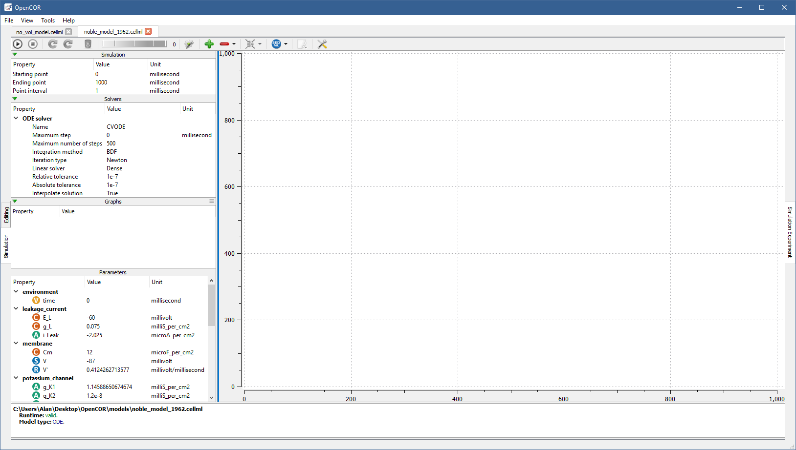
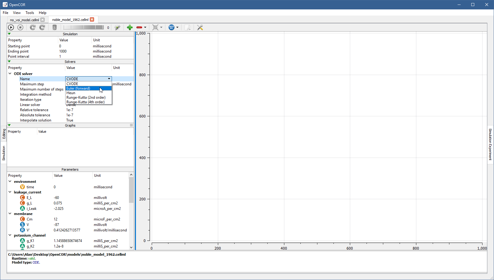
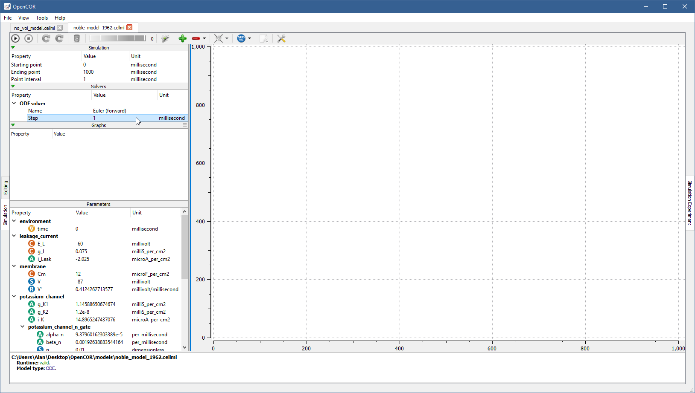
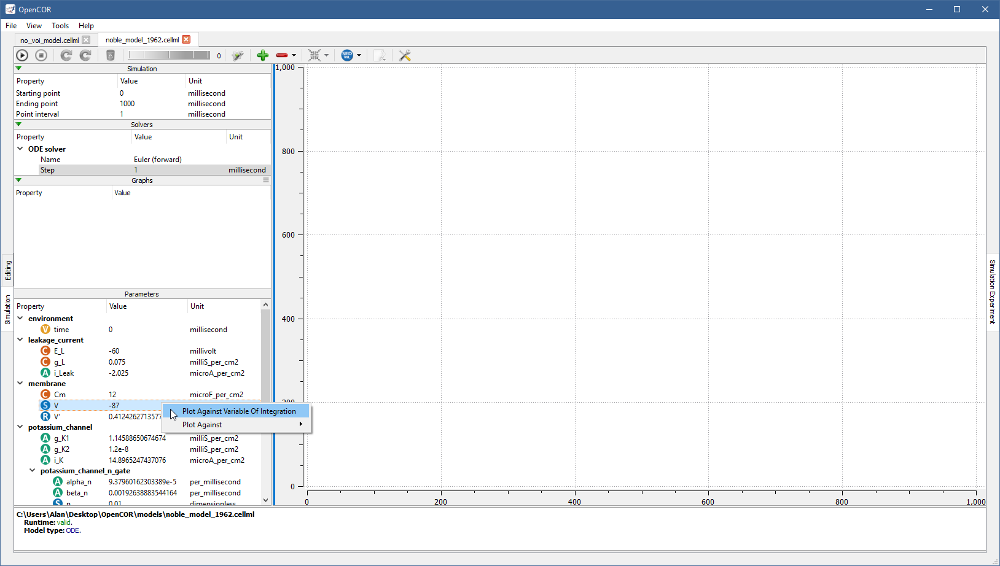
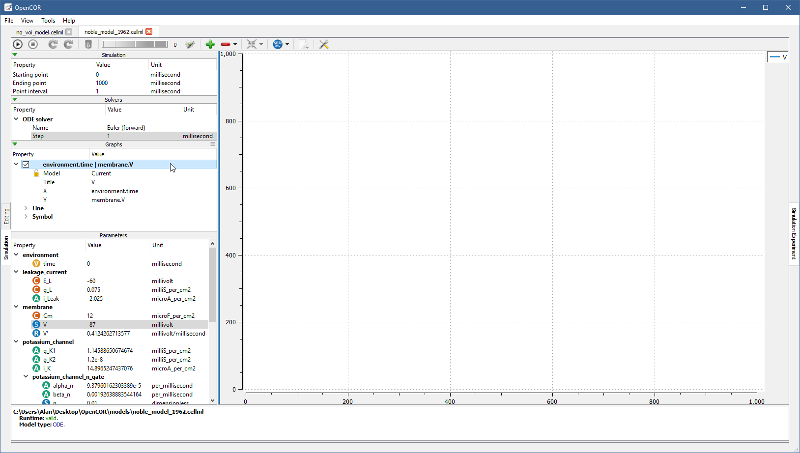

.. _plugins_simulation_simulationExperimentView:

=================================
 SimulationExperimentView plugin
=================================

The SimulationExperimentView plugin can be used to run `CellML <https://www.cellml.org/>`__ and `SED-ML <http://www.sed-ml.org/>`__ files, as well as `COMBINE <http://co.mbine.org/>`__ archives.
However, OpenCOR only supports a subset of `SED-ML <http://www.sed-ml.org/>`__, so only `SED-ML <http://www.sed-ml.org/>`__ files and `COMBINE <http://co.mbine.org/>`__ archives generated by OpenCOR are guaranteed to work.

A `CellML <https://www.cellml.org/>`__ file describes either a system of `ODEs <https://en.wikipedia.org/wiki/Ordinary_differential_equation>`__ or `DAEs <https://en.wikipedia.org/wiki/Differential_algebraic_equation>`__.

Open a CellML file
------------------

Upon opening a `CellML <https://www.cellml.org/>`__ file, OpenCOR checks that it can be used for simulation.
If it cannot, then a message describing the issue is shown:

.. image:: pics/SimulationExperimentViewScreenshot01.png
   :align: center
   :scale: 25%

On the other hand, if you open a valid `CellML <https://www.cellml.org/>`__ file (e.g. ``models/noble_model_1962.cellml``, which is shipped with OpenCOR), then the view will look something like:

It consists of two main parts, the first of which allows you to customise the simulation, the solver(s) and the model parameters, as well as to specify which graphs to plot.
The second part is used to plot the requested graphs.
In the ``Parameters`` section, all the model parameters have an icon associated with them to highlight their type:

| |iconVoi|              Variable of integration
| |iconConstant|         (Editable) constant
| |iconComputedConstant| Computed constant
| |iconState|            (Editable) state
| |iconRate|             Rate
| |iconAlgebraic|        Algebraic

.. |iconVoi| image:: pics/voi.png
   :class: icon
   :width: 16px

.. |iconConstant| image:: pics/constant.png
   :class: icon
   :width: 16px

.. |iconComputedConstant| image:: pics/computedConstant.png
   :class: icon
   :width: 16px

.. |iconState| image:: pics/state.png
   :class: icon
   :width: 16px

.. |iconRate| image:: pics/rate.png
   :class: icon
   :width: 16px

.. |iconAlgebraic| image:: pics/algebraic.png
   :class: icon
   :width: 16px

Simulate an ODE model
---------------------

To simulate a model, you need to provide some information about the simulation itself, i.e. its starting point, ending point and point interval.
Then, you need to specify the solver(s) that you want to use.
The solvers available to you depend on which :ref:`solver plugins <plugins_solver>` you selected, as well as on the type of your model (i.e. `ODE <https://en.wikipedia.org/wiki/Ordinary_differential_equation>`__ or `DAE <https://en.wikipedia.org/wiki/Differential_algebraic_equation>`__).
If you are dealing with an `ODE <https://en.wikipedia.org/wiki/Ordinary_differential_equation>`__ model and all the solver plugins are selected, then `CVODE <http://computation.llnl.gov/projects/sundials/cvode>`__, forward `Euler <https://en.wikipedia.org/wiki/Euler_method>`__, `Heun <https://en.wikipedia.org/wiki/Heun's_method>`__, and second-order and fourth-order `Runge-Kutta <https://en.wikipedia.org/wiki/Runge%E2%80%93Kutta_methods>`__ will be available to you:

Each solver comes with its own set of properties, which can be customised.
For example, if you select ``Euler (forward)``, you will see that it has only one property (``Step``):

You can start the simulation by pressing ``F9`` or by clicking on the |oxygenActionsMediaPlaybackStart| button.
Then, or before, you can add a graph.
All the model parameters are listed to the bottom-left of the view, grouped by components in which they were originally defined.
To add a graph, right click on a model parameter and select against which other model parameter you want it to be plotted.
For example, to create a graph for ``V`` (from the ``membrane`` component) against the variable of integration (i.e. time since the simulation properties are expressed in milliseconds):

.. |oxygenActionsMediaPlaybackStart| image:: ../../pics/oxygen/actions/media-playback-start.png
   :class: inlineicon
   :width: 16px

You can get the information associated with a graph by double clicking on it:

The ``Model`` property is used to associate the graph with a particular file.
By default, it has a value of ``Current``, which means that the graph is associated with the current file.
You can, however, explicitly associate it with another one.
The |oxygenStatusTaskAttention| icon will be shown next to the check box, if the association cannot be done, and next to the ``X`` and/or ``Y`` properties to highlight which model parameter(s) could not be found in the other file.
The |oxygenStatusObjectUnlocked| icon indicates that the graph is not locked, i.e. its ``Model`` property has a value of ``Current``, while the |oxygenStatusObjectLocked| icon is used when a graph is associated with a specific file (resulting in a red trace rather than a blue one).
The ``X`` and ``Y`` properties can be modified either by editing their value or by right clicking on them and selecting another model parameter from the context menu, which can also be used to add or remove a graph.

.. |oxygenStatusTaskAttention| image:: ../../pics/oxygen/status/task-attention.png
   :class: inlineicon
   :width: 16px

.. |oxygenStatusObjectUnlocked| image:: ../../pics/oxygen/status/object-unlocked.png
   :class: inlineicon
   :width: 16px

.. |oxygenStatusObjectLocked| image:: ../../pics/oxygen/status/object-locked.png
   :class: inlineicon
   :width: 16px

Back to the simulation, you can see that it failed with several model parameters having a value of ``nan`` (i.e. `not a number <https://en.wikipedia.org/wiki/NaN>`__).
This is because the solver is not properly set up: its ``Step`` property is too big.
If you set it to ``0.01 milliseconds``, reset all the model parameters (by clicking on the |oxygenActionsViewRefresh| button), clear the simulation data (by clicking on the |oxygenActionsTrashEmpty| button) and restart the simulation, then you will get something like:

.. |oxygenActionsViewRefresh| image:: ../../pics/oxygen/actions/view-refresh.png
   :class: inlineicon
   :width: 16px

.. |oxygenActionsTrashEmpty| image:: ../../pics/oxygen/actions/trash-empty.png
   :class: inlineicon
   :width: 16px

.. image:: pics/SimulationExperimentViewScreenshot07.png
   :align: center
   :scale: 25%

Roughly the same trace can be obtained using the ``CVODE`` solver:

.. image:: pics/SimulationExperimentViewScreenshot08.png
   :align: center
   :scale: 25%

However, the simulation is so quick to run that you will most probably not have time to see its progress.
Between the |oxygenActionsTrashEmpty| and |oxygenActionsRunBuildConfigure| buttons, there is a wheel that you can use to add a short delay between the plotting of two data points.
Thus, by using a value of ``100,000`` (or a bigger/smaller value, depending on the speed of your computer), you can run the simulation and pause it at a point of interest:

.. |oxygenActionsRunBuildConfigure| image:: ../../pics/oxygen/actions/run-build-configure.png
   :class: inlineicon
   :width: 16px

.. image:: pics/SimulationExperimentViewScreenshot09.png
   :align: center
   :scale: 25%

Now, you can modify any of the model parameters identified by either the |state| or |constant| icon (i.e. a state or a constant).
Say that you want to set ``g_Na_max`` (from the ``sodium_channel`` component) to ``0 milliS_per_cm2``.
To resume the simulation will then give you something like:

.. |state| image:: pics/state.png
   :class: inlineicon
   :width: 16px

.. |constant| image:: pics/constant.png
   :class: inlineicon
   :width: 16px

.. image:: pics/SimulationExperimentViewScreenshot10.png
   :align: center
   :scale: 25%

If you want, you can export some or all of the simulation data to a BioSignalML or a `CSV <https://en.wikipedia.org/wiki/Comma-separated_values>`__ file.
To do so, click on the |oxygenActionsDocumentExport| button.
In the case of BioSignalML, you will be asked to provide some (optional) information, as well as specify which model parameters you want to export:

.. |oxygenActionsDocumentExport| image:: ../../pics/oxygen/actions/document-export.png
   :class: inlineicon
   :width: 16px

.. image:: pics/SimulationExperimentViewScreenshot11.png
   :align: center
   :scale: 25%

In the case of `CSV <https://en.wikipedia.org/wiki/Comma-separated_values>`__, you will only need to specify the model parameters you want to export:

.. image:: pics/SimulationExperimentViewScreenshot12.png
   :align: center
   :scale: 25%

If you want to create other graphs, but do not want them on the same graph panel as the existing one, you can click on the |oxygenActionsListAdd| button to create a new graph panel:

.. |oxygenActionsListAdd| image:: ../../pics/oxygen/actions/list-add.png
   :class: inlineicon
   :width: 16px

.. image:: pics/SimulationExperimentViewScreenshot13.png
   :align: center
   :scale: 25%

You might have noticed that the bottom graph panel has a blue vertical line to its left.
This is to indicate that it is the currently selected graph panel (a graph panel can be selected by clicking on it).
Something else that you might have noticed is that the ``Graphs`` panel is now empty.
This is because there are currently no graphs associated with the graph panel.
Just for illustration, you can create a graph to plot ``V`` (from the ``membrane`` component) against ``V'`` (also from the ``membrane`` component):

.. image:: pics/SimulationExperimentViewScreenshot14.png
   :align: center
   :scale: 25%

You can create as many graph panels (and graphs) as you want.
The current graph panel or all the graph panels (but the first one) can be removed by clicking on the |oxygenActionsListRemove| button.

.. |oxygenActionsListRemove| image:: ../../pics/oxygen/actions/list-remove.png
   :class: inlineicon
   :width: 16px

Simulate a DAE model
--------------------

To simulate a `DAE <https://en.wikipedia.org/wiki/Differential_algebraic_equation>`__ model is similar to simulating an `ODE <https://en.wikipedia.org/wiki/Ordinary_differential_equation>`__ model, except that OpenCOR will also need to solve one or several systems of `non-linear algebraic <https://en.wikipedia.org/wiki/Nonlinear_system#Nonlinear_algebraic_equations>`__ equations:

.. image:: pics/SimulationExperimentViewScreenshot15.png
   :align: center
   :scale: 25%

Simulate a CellML 1.1 model
---------------------------

So far, we have only simulated `CellML 1.0 <https://www.cellml.org/specifications/cellml_1.0>`__ models, but you can also simulate `CellML 1.1 <https://www.cellml.org/specifications/cellml_1.1>`__ models, i.e. models that import units and/or components from other models:

.. image:: pics/SimulationExperimentViewScreenshot16.png
   :align: center
   :scale: 25%

Simulate several models at the same time
----------------------------------------

Each simulation is run in its own thread, which means that several simulations can be run at the same time.
Simulations running in the background display a small progress bar in the top tab bar while the foreground simulation uses the main progress bar at the bottom of the view:

.. image:: pics/SimulationExperimentViewScreenshot17.png
   :align: center
   :scale: 25%

SED-ML support
--------------

An important aspect of modelling is reproducibility.
To that end, a simulation can be exported to `SED-ML <http://www.sed-ml.org/>`__ by clicking on the |sedmlLogo| button.
The export can then be done either to a `SED-ML <http://www.sed-ml.org/>`__ file or a `COMBINE <http://co.mbine.org/>`__ archive, both of which can then be re-run by OpenCOR and any `SED-ML <http://www.sed-ml.org/>`__ capable software (e.g. `SED-ML Web Tools <http://sysbioapps.dyndns.org/SED-ML_Web_Tools>`__).

.. |sedmlLogo| image:: ../../pics/sedmlLogo.png
   :class: inlineicon
   :width: 16px

A `SED-ML <http://www.sed-ml.org/>`__ file (or a `COMBINE <http://co.mbine.org/>`__ archive) contains all the information needed to reproduce a simulation, i.e. a reference to the model (or even the model itself in the case of a `COMBINE <http://co.mbine.org/>`__ archive; the referenced model can be opened by clicking on the |cellmlLogo| button), the parameters of the simulation, the solver and its properties, the number of graph panels, and the graphs to be plotted in each graph panel.
Thus, once open, a simulation can be re-run by pressing ``F9`` or by clicking on the |oxygenActionsMediaPlaybackStart| button:

.. |cellmlLogo| image:: ../../pics/cellmlLogo.png
   :class: inlineicon
   :width: 16px

.. image:: pics/SimulationExperimentViewScreenshot18.png
   :align: center
   :scale: 25%

Please note that changes to model parameters (either before or in the middle of a simulation) are not currently supported, and will therefore be ignored, if present.

Plotting area
-------------

The plotting area offers several features that can be activated by:

- **Synchronising the X and/or Y axes:**

  - Using the context menu.

- **Using custom axes:**

  - Using the context menu.

- **Zooming in/out:**

  - Holding the right mouse button down, and moving the mouse to the bottom-right/top-left to zoom in/out; or
  - Moving the mouse wheel up/down; or
  - Using the context menu.

- **Resetting the zoom level:**

  - Double-clicking on the left mouse button; or
  - Using the context menu.

- **Zooming into a region of interest:**

  - Pressing ``Ctrl`` and holding the right mouse button down, and moving the mouse around.

- **Panning:**

  - Holding the left mouse button down, and moving the mouse around.

- **Showing the coordinates of any point:**

  - Pressing ``Shift`` and holding the left mouse button down, and moving the mouse around.

- **Copying the contents of the plotting area to the clipboard:**

  - Using the context menu.

Tool bar
--------

| |toolBarOxygenActionsMediaPlaybackStart|   Run the simulation
| |toolBarOxygenActionsMediaPlaybackPause|   Pause the simulation
| |toolBarOxygenActionsMediaPlaybackStop|    Stop the simulation
| |toolBarResetStateModelParameters|         Reset the state model parameters
| |toolBarOxygenActionsViewRefresh|          Reset all the model parameters
| |toolBarOxygenActionsTrashEmpty|           Clear the simulation data
| |toolBarOxygenActionsRunBuildConfigure|    Enable/disable the development mode
| |toolBarOxygenActionsListAdd|              Add a graph panel
| |toolBarOxygenActionsListRemove|           Remove the current graph panel or all the graph panels
| |toolBarCellmlLogo|                        Open the referenced CellML file
| |toolBarSedmlLogo|                         Export the simulation to SED-ML
| |toolBarOxygenActionsDocumentExport|       Export the simulation data
| |toolBarOxygenCategoriesPreferencesSystem| Preferences for the Simulation Experiment view

.. |toolBarOxygenActionsMediaPlaybackStart| image:: ../../pics/oxygen/actions/media-playback-start.png
   :class: toolbar
   :width: 24px

.. |toolBarOxygenActionsMediaPlaybackPause| image:: ../../pics/oxygen/actions/media-playback-pause.png
   :class: toolbar
   :width: 24px

.. |toolBarOxygenActionsMediaPlaybackStop| image:: ../../pics/oxygen/actions/media-playback-stop.png
   :class: toolbar
   :width: 24px

.. |toolBarResetStateModelParameters| image:: pics/resetStateModelParameters.png
   :class: toolbar
   :width: 24px

.. |toolBarOxygenActionsViewRefresh| image:: ../../pics/oxygen/actions/view-refresh.png
   :class: toolbar
   :width: 24px

.. |toolBarOxygenActionsTrashEmpty| image:: ../../pics/oxygen/actions/trash-empty.png
   :class: toolbar
   :width: 24px

.. |toolBarOxygenActionsRunBuildConfigure| image:: ../../pics/oxygen/actions/run-build-configure.png
   :class: toolbar
   :width: 24px

.. |toolBarOxygenActionsListAdd| image:: ../../pics/oxygen/actions/list-add.png
   :class: toolbar
   :width: 24px

.. |toolBarOxygenActionsListRemove| image:: ../../pics/oxygen/actions/list-remove.png
   :class: toolbar
   :width: 24px

.. |toolBarCellmlLogo| image:: ../../pics/cellmlLogo.png
   :class: toolbar
   :width: 24px

.. |toolBarSedmlLogo| image:: ../../pics/sedmlLogo.png
   :class: toolbar
   :width: 24px

.. |toolBarOxygenActionsDocumentExport| image:: ../../pics/oxygen/actions/document-export.png
   :class: toolbar
   :width: 24px

.. |toolBarOxygenCategoriesPreferencesSystem| image:: ../../pics/oxygen/categories/preferences-system.png
   :class: toolbar
   :width: 24px
