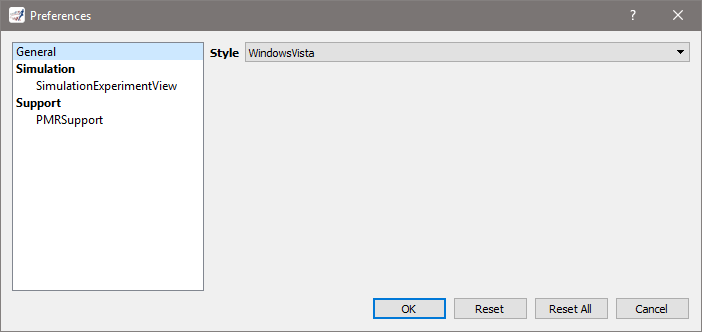

.. _preferences:

=============
 Preferences
=============

Certain aspects of OpenCOR, and of its plugins, can be configured through preferences, as can be seen by opening the Preferences dialog (either by selecting the ``Tools`` | ``Preferences...`` menu or by clicking `here <opencor://openPreferencesDialog>`__):

