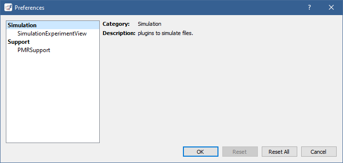

.. _preferences:

=============
 Preferences
=============

Certain aspects of OpenCOR, and of its plugins, can be configured through preferences, as can be seen by opening the Preferences dialog (either by selecting the ``Tools`` | ``Preferences...`` menu or by clicking `here <opencor://openPreferencesDialog>`__):

OpenCOR preferences are currently limited to the style used to render the :ref:`GUI <userInterfaces_graphicalUserInterface>`.
Thus, on `Windows <https://en.wikipedia.org/wiki/Microsoft_Windows>`__, we can choose between the ``Fusion``, ``Windows``, ``WindowsVista`` and ``WindowsXP`` styles while on `Linux <https://en.wikipedia.org/wiki/Linux>`__, we can choose betwen ``Fusion`` and ``Windows``, and between ``Fusion``, ``Macintosh`` and ``Windows`` on `macOS <https://en.wikipedia.org/wiki/MacOS>`__.
``WindowsVista`` is the default style on `Windows <https://en.wikipedia.org/wiki/Microsoft_Windows>`__ while it is ``Fusion`` on `Linux <https://en.wikipedia.org/wiki/Linux>`__ and ``Macintosh`` on `macOS <https://en.wikipedia.org/wiki/MacOS>`__.
