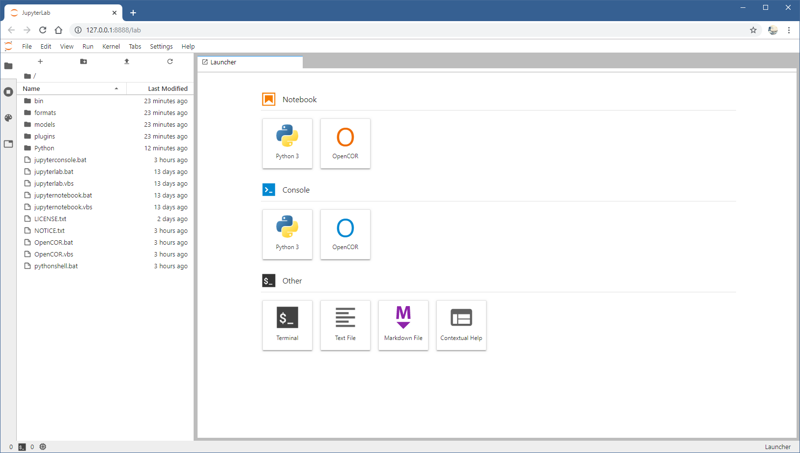
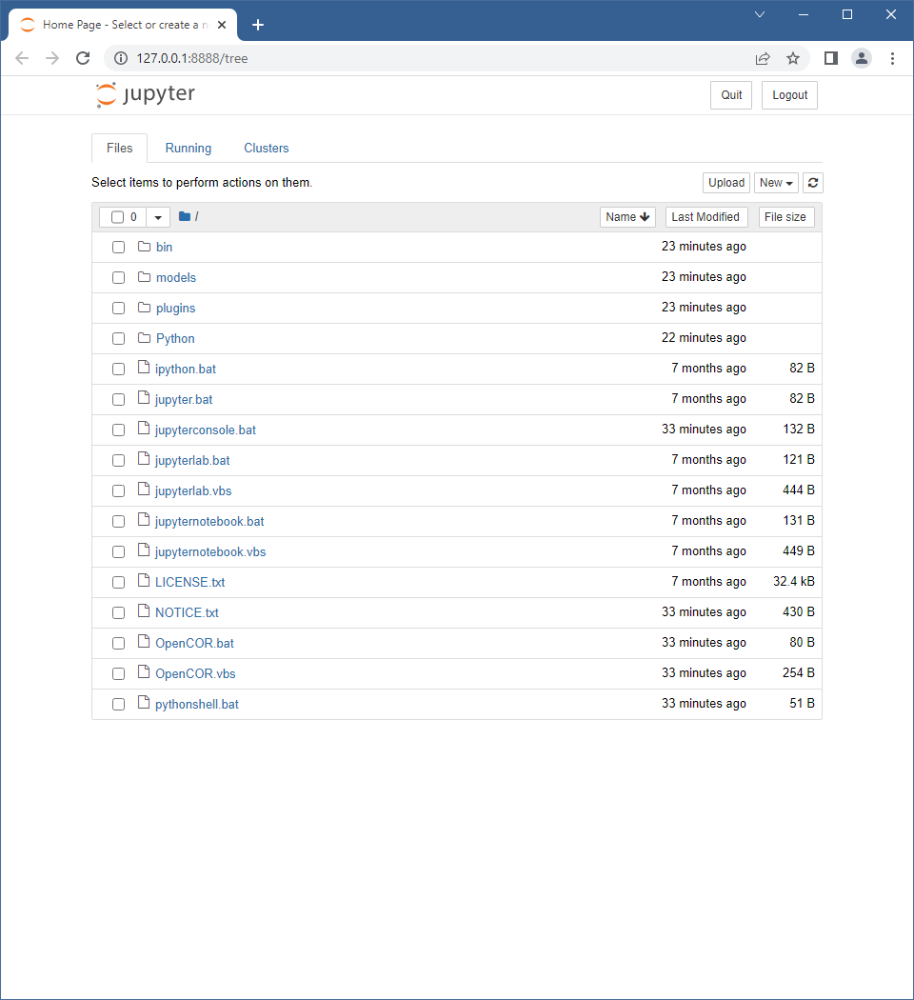

.. _userInterfaces_commandLineInterfacePythonRelatedScripts:

========================
 Python-related scripts
========================

The following `Python <https://python.org/>`__-related scripts can be used to start:

- ``jupyterconsole[.bat]``: a `Jupyter <https://jupyter.org/>`__ console, i.e. a terminal frontend for `Jupyter <https://jupyter.org/>`__ kernels;
- ``jupyterlab[.bat|.vbs]``: a `JupyterLab <https://jupyterlab.readthedocs.io/en/latest/>`__, i.e. a Web-based interactive development environment for `Jupyter Notebooks <https://jupyter-notebook.readthedocs.io/en/latest/>`__, code and data;
- ``jupyternotebook[.bat|.vbs]``: a `Jupyter Notebook <https://jupyter-notebook.readthedocs.io/en/latest/>`__, i.e. a Web application to create and share documents that contain live code, equations, visualizations and narrative text; and
- ``pythonshell[.bat]``: a `Python <https://python.org/>`__ shell.

This, in OpenCOR's environment.

``jupyterconsole[.bat]``
------------------------

::

  $ ./jupyterconsole
  Jupyter console 6.0.0

  Jupyter kernel for OpenCOR

  In [1]:

``jupyterlab[.bat]``
--------------------

::

  $ ./jupyterlab

``jupyternotebook[.bat]``
-------------------------

::

  $ ./jupyternotebook

.. _userInterfaces_commandLineInterfacePythonRelatedScriptsPythonshell:

``pythonshell[.bat]``
---------------------

This script is a shortcut to using the :ref:`PythonShell <plugins_miscellaneous_pythonShell>` plugin.
Thus,

::

  $ ./pythonshell

is an alias for:

::

  $ ./OpenCOR -c PythonShell $*
